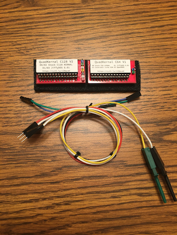
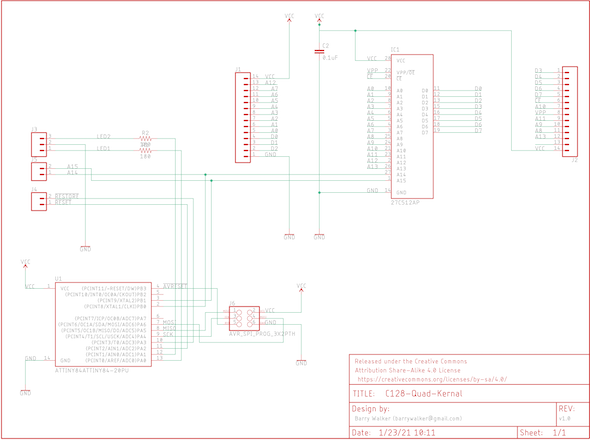
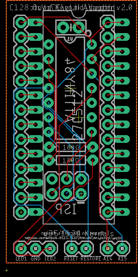

       ____ _ ____  ___     ___                  _   _  __                     _
      / ___/ |___ \( _ )   / _ \ _   _  __ _  __| | | |/ /___ _ __ _ __   __ _| |
     | |   | | __) / _ \  | | | | | | |/ _` |/ _` | | ' // _ \ '__| '_ \ / _` | |
     | |___| |/ __/ (_) | | |_| | |_| | (_| | (_| | | . \  __/ |  | | | | (_| | |
      \____|_|_____\___/   \__\_\\__,_|\__,_|\__,_| |_|\_\___|_|  |_| |_|\__,_|_|







#### Introduction

This repository holds the following:

- Eagle layout files for the U32 and U35 adapters for a C128. The C128 adapter contains an attiny84 microcontroller that manages A14 and A15 of the 27c512 EEPROM and determines which of the 4 kernals are selected. If the C64 adapter is also installed with the required A14/A15 cable, the attiny84 will also select the kernal of that EEPROM as well.
- Arduino sketch for the attiny84 firmware that controls the selected kernal


#### How does this work?

The C128 contains a 16k C128 Kernal in U35 and a 16k C64 BASIC/Kernal (8k BASIC, 8k Kernal) in U32. With a 64k 27C512 EEPROM, we would have 4 images (4 x 16k = 64k). Often we'd like to use something like JiffyDOS on our 128, but still have the ability to use the stock Kernal for the rare programs that don't work with JiffyDOS.

This requires us to swap the 2 existing 16k ROMS for 2 64k ROMs but give us a way to select which of the 4 kernals to use. Most solutions require a switch or soldering. This solution uses an ATTINY84 microcontroller and the RESTORE key to select our kernal.

The key to all of this is to control the A14 and A15 lines of the 27C512 EEPROM. Ordinarily, a 16k chip only requires 14 address lines (A0-A13). With a 64k chip, we need 16 address lines (A0-A15), but the C128 wasn't designed to deal with them on these ROM chips. With this adapter, we can control these 2 lines to give us 4 kernals (00, 01, 10, 11). The attiny84 microcontroller listens to the RESTORE line to see when we'd like to change kernals. When a new kernal is selected, A14 & A15 are updated to select the kernal and the machine is reset.


#### Building with the Arduino IDE

TODO


#### Generating Gerber files for manufacture

Open the `.brd` files for both C128-Quad-Kernal and C64-Quad-Kernal as you'll need both boards. If you only plan on having kernal swap for the 64 side of the 128, then open the C128-Quad-Kernal brd file. This is the board with the attiny84 chip and it will control A14/A15 of the EEPROM.

Click the button on the toolbar labeled, `Generate CAM Data`. It looks like a factory with a green down arrow. This will generate a ZIP file that you can upload to your board house (I use <a href="https://www.pcbway.com/setinvite.aspx?inviteid=340813" target="_blank">PCBWay</a> and they're awesome!).

#### Loading your EEPROM

The quad kernal boards will only work with a 27C512 64k EEPROM and there's no provision for using a 27C256 EEPROM. That means you can fit 4x16k ROMS onto the chips. If you plan to use multiple kernals for both the 128 and the 64 then you will need 2x 27C512 EEPROM chips (or EPROM chips if you don't mind dealing with UV).

The 128 Kernal uses a single 16k image and nothing special needs to be done other than concatenating 4 separate 16k images. The 64 side of things is a bit different, however. It includes BASIC 2.0 as well as the 64 Kernal. Each 16k slot needs to contain 8k BASIC + 8k KERNAL.

On a Mac, you can create a 64k 128 KERNAL rom like this:

```bash
cat kernal1.rom kernal2.rom kernal3.rom kernal4.rom > kernal128_final.rom
```

For a 64 ROM:

```bash
cat basic1.rom kernal1.rom basic2.rom kernal2.rom basic3.rom kernal3.rom basic4.rom kernal4.rom > basicandkernal64_final.rom
```

If you're only replacing the KERNAL on a C64, then you can duplicate the same BASIC rom:

```bash
cat basic.rom kernal1.rom basic.rom kernal2.rom basic.rom kernal3.rom basic.com kernal4.rom > basicandkernal64_final.rom
```

#### Required cables

The boards will require the following cables:

- 3pin to 3pin F2M dupont connector for the C128's LED. The colors should match the C128 LED which is red, white (ground), black


- 2pin to 2pin F2F dupont connector between the 2 boards A14/A15 headers


- 2pin dupont to mini grabbers. These attach to U63 and U16 for the reset and restore lines. Yellow is reset and white is restore. Attach the white minigrabber end to U16 pin 9 and the yellow minigrabber to U63 pin 2.


#### Installation

Once you have the attiny84 chip programmed, your EEPROMs programmed, the boards populated and the cables built, it's time to install them!

If you're installing both the 128 and 64 boards, first remove the existing chip in U35 and set it aside. Put the board containing the 128 EEPROM in U35 and make sure the header pins are facing the rear of the machine! Do the same for the board containing the 64 EEPROM but for U32.

Next, connect the 2pin-to-2pin cable between the 2 boards. They will need to connect to the A14/A15 header pins on both boards.

Connect the 3pin-to-3pin cable between the 128's LED connector and the LED1, GND, LED2 connector.

Connect the 2pin cable to the RESET/RESTORE header pins. The other end of the RESET cable needs to clip to pin 8 of U63 which is in the back, left corner of the machine. The other end of the RESTORE cable needs to clip to pin 9 of U16 which is toward the front, right of the machine. Don't solder these. Use mini grabbers instead.

#### Operation

The adapter has 2 modes: the default mode will only flash the current KERNAL when the machine is first powered on and then illuminate both LEDs. The alternate mode will keep the current KERNAL illuminated at all times.

To swap modes, hold down the RESTORE key when the machine is powered on. The LEDs will quickly flash in an alternating pattern to show that the mode has changed.

Enter select mode by holding down the RESTORE key until the 128's LED flashes. Release the restore key to begin select mode. The C128's LEDs will light to indicate the current selected KERNAL in binary form. Tap the RESTORE key until the LED shows the binary value of the KERNAL you'd like to use. Finally, hold down the RESTORE key again to save the KERNAL and reset the machine. It should restart with the selected KERNAL.

In the default mode, the LEDs will flash the currently selected KERNAL 5 times on the 128's LEDs. In the case of KERNAL 00 being selected, no LEDs will illuminate.

In the alternate mode, the LEDs will illuminate to show the currently selected KERNAL.

You can also double tap the RESTORE key in quick succession to advance to the next KERNAL.

#### Updating the firmware

The adapter has an ISP port to allow for easy re-programming. You will need something like this: https://www.sparkfun.com/products/11801

Connect the adapter to your programmer with a 6 pin ISP cable and write the firmware out using avrdude or the Arduino IDE.

#### Version 1

There is an earlier version of this board that uses a PIC12F629 located here: https://github.com/barryw/C128QuadKernal/tree/master

This board does not allow for reprogramming the chip in-circuit.
